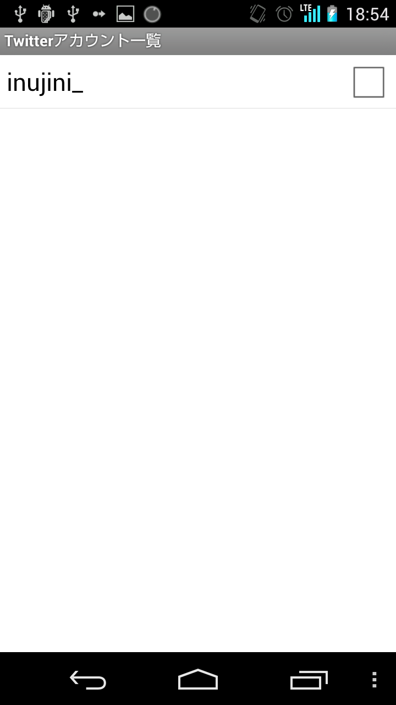

#Twitter連携アカウント管理画面（AccountListActivity）

<index>
1. [レイアウト](#layout)
2. [利用者向けガイド](#guide)
    1. [アカウント選択](#guide-select)
    2. [アカウント追加](#guide-add)
    3. [アカウント削除](#guide-delete)
3. [（開発者向け）機能概要](#summary)
4. [（開発者向け）ソース](#source)
</index>

##layout

##guide

###guide-select
チェックボックスにチェックが入っているアカウントはすべてTwitter連携対象アカウントになります。

連携対象からはずしたい場合はチェックをはずせばOKです。

###guide-add
オプションメニューから「追加」を選択することで連携対象にしたいアカウントを追加することが出来ます。

###guide-delete
もう使用したくないアカウントをロングタップすると削除確認ダイアログが表示されます。

問題なければOKをクリックして削除してください。

##summary
TODO:stub

##source
* [AccountListActivity.java](https://github.com/tumbling-dice/Hatate/blob/master/src/inujini_/hatate/AccountListActivity.java)
* [activity_list.xml](https://github.com/tumbling-dice/Hatate/blob/master/res/layout/activity_list.xml)
* [adapter_account_list.xml](https://github.com/tumbling-dice/Hatate/blob/master/res/layout/adapter_account_list.xml)
* [menu_account_list.xml](https://github.com/tumbling-dice/Hatate/blob/master/res/menu/menu_account_list.xml)

[LastUpdate](2014/11/02)