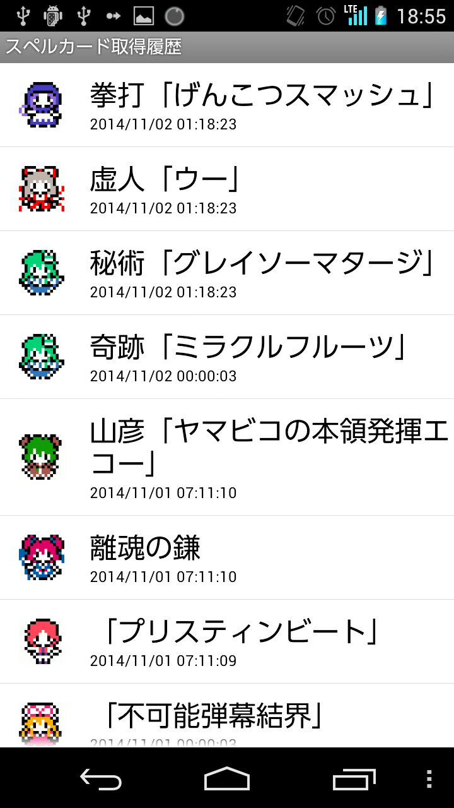

#スペルカード取得履歴画面（SpellCardHistoryActivity）

<index>
1. [レイアウト](#layout)
2. [利用者向けガイド](#guide)
3. [（開発者向け）機能概要](#summary)
4. [（開発者向け）ソース](#source)
</index>

##layout

##guide
最近取得したスペルカードを見ることが出来ます。

最新20件まで見ることが可能です。

##summary
TODO:stub

##source
* [SpellCardHistoryActivity.java](https://github.com/tumbling-dice/Hatate/blob/master/src/inujini_/hatate/SpellCardHistoryActivity.java)
* [activity_list.xml](https://github.com/tumbling-dice/Hatate/blob/master/res/layout/activity_list.xml)
* [adapter_spellcard_history.xml](https://github.com/tumbling-dice/Hatate/blob/master/res/layout/adapter_spellcard_history.xml)

[LastUpdate](2014/11/02)
