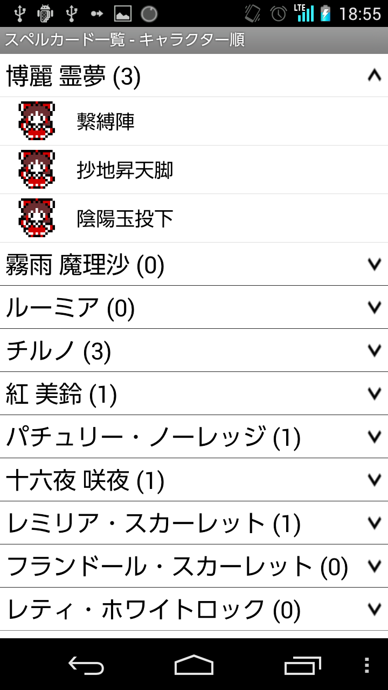
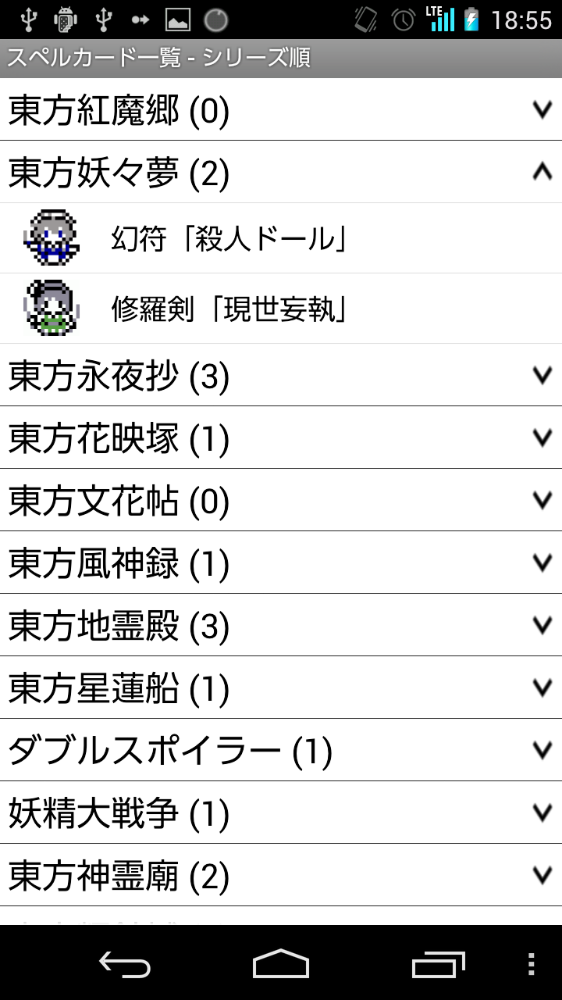
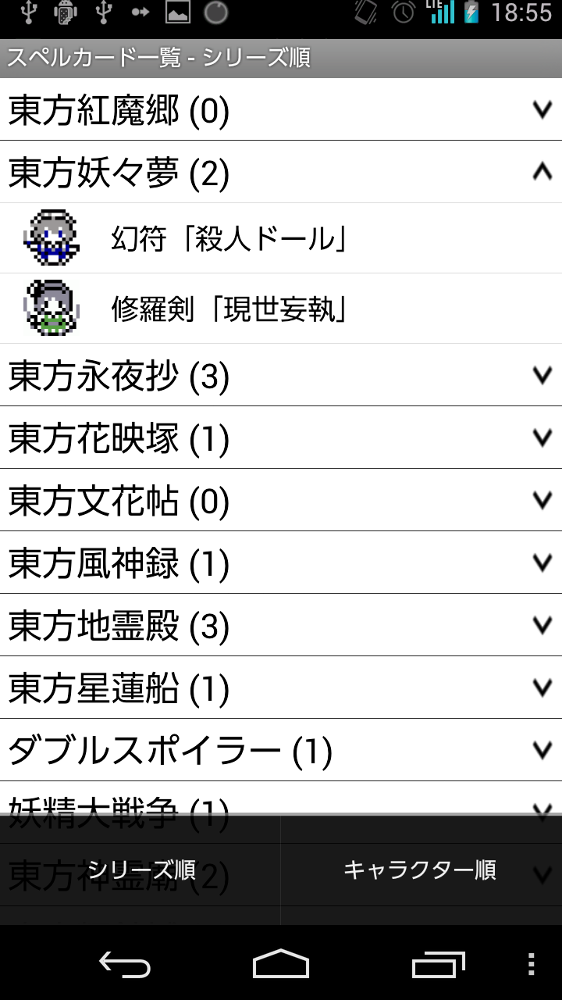

#スペルカード図鑑画面（SpellCardLibraryActivity）

<index>
1. [レイアウト](#layout)
2. [利用者向けガイド](#guide)
    1. [キャラクター順](#guide-character-sort)
    2. [シリーズ順](#guide-series-sort)
3. [（開発者向け）機能概要](#summary)
4. [（開発者向け）ソース](#source)
</index>

##layout

##guide
今までに手に入れたスペルカードを眺めることが出来ます。

現在1枚も所持していないキャラクター、シリーズのものは見ることが出来ません。

###guide-character-sort
スペルカードをキャラクター順に並べます。

オプションメニューからキャラクター順・シリーズ順を切り替えることが出来ます。デフォルトではキャラクター順です。

###guide-series-sort
スペルカードをシリーズ順に並べます。

各シリーズに共通のスペルカードも存在するため、実際の枚数とは異なる可能性があります。

オプションメニューからキャラクター順・シリーズ順を切り替えることが出来ます。デフォルトではキャラクター順です。

##summary
TODO:stub

##source
* [SpellCardLibraryActivity.java](https://github.com/tumbling-dice/Hatate/blob/master/src/inujini_/hatate/SpellCardLibraryActivity.java)
* [activity_list.xml](https://github.com/tumbling-dice/Hatate/blob/master/res/layout/activity_list.xml)
* [adapter_spellcard_library_parent.xml](https://github.com/tumbling-dice/Hatate/blob/master/res/layout/adapter_spellcard_library_parent.xml)
* [adapter_spellcard_library_child.xml](https://github.com/tumbling-dice/Hatate/blob/master/res/layout/adapter_spellcard_library_child.xml)

[LastUpdate](2014/11/10)