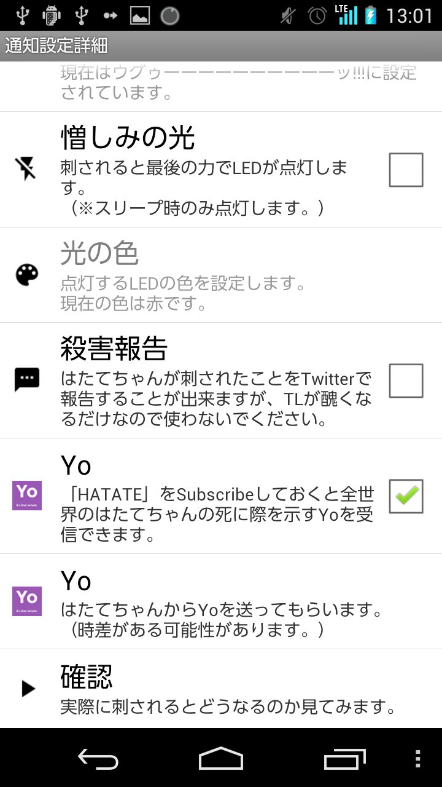

#Yoによるはたテロ

<index>
1. [Yoのインストール](#yo-install)
2. [HATATEのSubscribe](#yo-subscribe)
3. [Yoの受信](#yo-receive)
4. [Yoの送信](#yo-send)
</index>

##yo-install
[Google Play](https://play.google.com/store/apps/details?id=com.justyo&hl=ja)か[App Store](https://itunes.apple.com/jp/app/yo./id834335592?mt=8&ign-mpt=uo%3D4)からインストールします。

インストールし終わったら起動して適当にユーザを登録しておきましょう。

##yo-subscribe

「HATATE」と言うユーザにYoを一度でも送っておけば「HATATEをSubscribeした」とみなされます。

Subscribeは、Twitterで言えばフォローみたいなものです。

通知詳細設定ではたてちゃんからYoを送ってもらうことでYoのリスト上にHATATEちゃんが現れます。

**ただし、一度でも自分からHATATEにYoを送っていないとSubscribeしたとは認識されません。**

##yo-receive

HATATEをSubscribeしておくと誰かがはたてちゃんを包丁で刺した時にYoを受け取ることが出来ます。

**Androidじゃなくても受け取れます。**はたテロです。

##yo-send

通知詳細設定のYoにチェックボックスを入れておけばはたテロに参加することが出来ます。

[LastUpdate](2014/11/16)